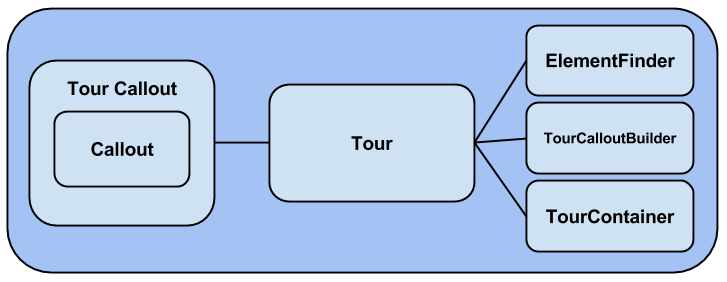

# EmperorTour

## About EmperorTour

EmperorTour is free open source tour library in javascript.

## Goals

The desiging and implementation of this library are as follows:
 - It is library (It means it should not force anything to user/page and should not affected by user/page)
 - Simply testable
 - Configurable (Accept tour config when be initialized)
 - Easily customizable (change behaviour easily by using events or overriding methods)

## Architecture

 - Callout: 
 	This class is just responsible to render the callout border and simple content. 
 - TourCallout:
 	This class inherits Callout class and responsible to implement title, content, next, previous and etc buttons on callout
 - Tour:
 	This class implments the behaviour of tour/callout on defined scope and container.
 - ElementFinder:
 	This class is designed to be responsible to find all elements which are passed as config to Tour object. This class can be replaced or overriden to change the behaviour and make the project testable.
 - TourCalloutBuilder:
 	It is the factory for TourCallour object
 - TourContainer:
 	This class is used to find the place which callouts have to be rendered in.